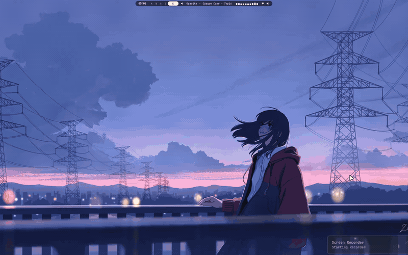

# FiorenDot

Personal dotfiles and system configurations for **Arch Linux** running **Hyprland** Wayland compositor.

---

## Demo & Previews

[](assets/videos/FioDot.mp4)

> 🎬 **[▶ Click here to download / watch high-resolution video with audio (FioDot.mp4)](assets/videos/FioDot.mp4)**
>
> *Showcasing Hyprland tiling, Waybar (Fioren V1), Rofi launcher, fastfetch, terminal, and animations.*

---

## System Stack & Components

| Component | Software / Tool | Description |
| :--- | :--- | :--- |
| **OS** | Arch Linux | Rolling-release base |
| **Compositor** | Hyprland | Dynamic tiling Wayland compositor |
| **Status Bar** | Waybar | Custom modules & layout (`Fioren V1`) |
| **App Launcher** | Rofi-wayland | Application menu, beats, wallpapers, calculator |
| **Notification** | SwayNC | Wayland notification daemon & control center |
| **Terminals** | Kitty / Ghostty | GPU-accelerated terminal emulators |
| **Shell** | Zsh + Oh My Zsh | Shell environment with plugins & completions |
| **Prompt** | Starship | Cross-shell customizable prompt |
| **Theming / Colors** | Wallust | Automatic color palette generation from wallpaper |
| **Power Menu** | Wlogout | Logout, lock, reboot, and power options |
| **Visualizer** | Cava | Audio visualizer |
| **System Monitor**| Btop | Terminal resource monitor |
| **Screenshots** | Swappy + Grim/Slurp | Screen capture & annotation |
| **GTK & Qt Theme**| GTK 3/4, Kvantum, Qt5ct, Qt6ct | Unified desktop theme & styling |

---

## Repository Structure

```
FiorenDot/
├── .config/
│   ├── btop/               # Btop resource monitor config
│   ├── cava/               # Audio visualizer config
│   ├── fastfetch/          # System specs fetch config
│   ├── ghostty/            # Ghostty terminal config
│   ├── gtk-3.0/            # GTK 3 settings
│   ├── gtk-4.0/            # GTK 4 settings
│   ├── hypr/               # Hyprland WM configs, UserConfigs, UserScripts, hyprlock
│   ├── kitty/              # Kitty terminal config & themes
│   ├── Kvantum/            # Kvantum Qt theme config
│   ├── nwg-look/           # GTK theme switcher config
│   ├── qt5ct/              # Qt5 config
│   ├── qt6ct/              # Qt6 config
│   ├── rofi/               # Rofi app launcher, themes & menus
│   ├── starship.toml       # Starship shell prompt config
│   ├── swappy/             # Screenshot annotator config
│   ├── swaync/             # Sway notification center config
│   ├── wallust/            # Dynamic palette generation config
│   ├── waybar/             # Waybar configs & styles (Fioren V1)
│   └── wlogout/            # Logout / power menu config
├── assets/
│   ├── gif/                # Inline autoplay animated demo (demo.gif)
│   ├── screenshots/        # Preview screenshot poster (preview.png)
│   └── videos/             # Full video demo (FioDot.mp4)
├── .zshrc                  # Zsh shell configuration
├── .zprofile               # Zsh login profile
├── install.sh              # Automated backup & deployment script
└── .gitignore              # Ignored files & caches
```

---

## Installation

### 1. Clone the repository

```bash
git clone https://github.com/Leshoraa/FiorenDot.git ~/FiorenDot
cd ~/FiorenDot
```

### 2. Run the installer

The included `install.sh` script automates backing up any existing configurations in `~/.config` before creating links or copying files.

```bash
# Preview actions without making changes
./install.sh --dry-run

# Symlink configurations (recommended for tracking dotfiles)
./install.sh --symlink

# Alternatively, copy files directly
./install.sh --copy
```

#### Flags

- `-s, --symlink`: Symlink files into `~/.config` and `~/` (default).
- `-c, --copy`: Copy files instead of symlinking.
- `-n, --dry-run`: Display actions without modifying disk.
- `--no-backup`: Disable automatic backup of existing config folders.
- `-h, --help`: Display command usage.

---

## Keybindings Reference

| Shortcut | Action |
| :--- | :--- |
| `Super + Return` | Open default terminal (Kitty / Ghostty) |
| `Super + D` | Open Rofi application launcher |
| `Super + T` | Open default file manager |
| `Super + B` | Open default web browser |
| `Super + Space` | Toggle floating mode & center window |
| `Super + Shift + F` | Toggle fullscreen |
| `Super + Alt + F` | Toggle maximize |
| `Super + Q` / `Super + C` | Close active window |
| `Super + Alt + V` | Open clipboard manager |
| `Super + Alt + R` | Refresh Waybar, SwayNC, and desktop components |
| `Super + H` | Toggle keybind cheat sheet |
| `Super + Alt + E` | Emoji picker |

*User-specific key overrides are defined in `.config/hypr/UserConfigs/UserKeybinds.conf`.*

---

## Dependencies

Ensure the following packages are installed on Arch Linux:

```bash
sudo pacman -S hyprland waybar rofi-wayland swaync kitty zsh starship cava btop swappy grim slurp kvantum qt5ct qt6ct
```

Optional/AUR tools:
```bash
yay -S wallust-git wlogout ghostty fastfetch
```

---

## License & Credits

- Configurations maintained by [Leshoraa](https://github.com/Leshoraa).
- Base Hyprland structure inspired by the Arch-Hyprland community.
